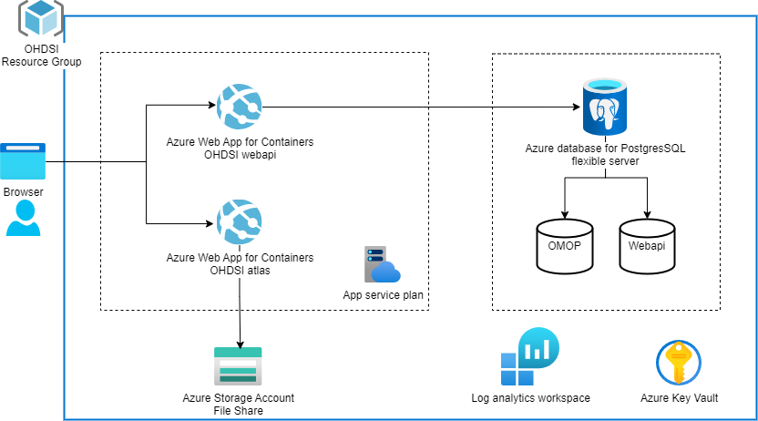

# Introduction

OHDSI on Azure GitHub repository is designed to ease deployment of tools provided by the Observational Health Data Sciences and Informatics (OHDSI, pronounced "Odyssey") community on to Azure. We are guided by our Hypothesis and core objectives.

**Hypothesis -** “OHDSI on Azure will empower IT department and operations teams to support researchers, thus increasing researchers' motivation to act on new ideas”

## Objectives

1. Decreased Deployment challenges
2. Increased access to funding
3. Simplified adoption strategy

OHDSI on Azure is a set of scripts and templates designed to automate the deployment of the OHDSI in the Microsoft Azure cloud using Biceo & PaaS services. It is designed to facilitate standardized scalable deployments within customer managed Azure subscriptions. Provide best practices for running OHDSI on Azure. Ease the burden of management and cost monitoring of research projects.

OHDSI on Azure has taken a container-based approach to operating OHDSI tools. Therefore, OHDSI on Azure does its best to not host code developed by the [OHDSI community](https://github.com/OHDSI). Our deployment templates pull containers from Docker Hub.

We invite you and your organization to participate in the continued feature expansion of OHDSI on Azure.

This repository assumes the end user is familiar with the OHDSI/ OMOP community, Azure, and Bicep.

Some of the OHDSI projects included:

* [Common Data Model (CDM)](https://github.com/OHDSI/CommonDataModel), including [Vocabulary](https://github.com/OHDSI/Vocabulary-v5.0)
* [Atlas](https://github.com/OHDSI/Atlas) - OSS tool used to conduct analyses on standardized observational data converted to the OMOP Common Data Model V5
* [WebApi](https://github.com/OHDSI/WebAPI) - contains all OHDSI RESTful services that can be called from OHDSI applications
* [Achilles](https://github.com/OHDSI/Achilles) - provides descriptive statistics on an OMOP CDM database
* [ETL-Synthea](https://github.com/OHDSI/ETL-Synthea) - Conversion from Synthea CSV to OMOP CDM

## Overview

Once deployed, The OHDSI on Azure solution will have the following components:

1. An Atlas and Webapi instances will be deployed as container on Azure App Service. The images get pulled from Docker Hub. Both sites will be deployed into a single App Service Plan.
2. A Storage Account will be deployed with a filesystem. This is used to store the Atlas configuration files.
3. Azure database for PostgreSQL will be deployed with different databases - one for the OMOP CDM and one for the Atlas WebAPI schemas.
4. Key Vault will be deployed to store the database credentials and other secrets.
5. Log Analytics workspace will be deployed to collect logs from the App Services, PostgreSQL and Key Vault.

* You can host your CDM in Azure PostgreSQL. You can load your vocabularies into Azure Storage Container as cs.gz files, and pass as a paramater in your custom deployment.

## CDM Version

This setup is based on the [CDM v5.4.0 for PostgreSQL](https://github.com/OHDSI/CommonDataModel/tree/main/inst/ddl/5.4/postgresql).

## Getting Started

To get started, click on deploy to Azure button.
To get more detailed instructions, please refer to the [Deployment Guide](./docs/DeploymentGuide.md).

## Contributing

This project welcomes contributions and suggestions.  Most contributions require you to agree to a
Contributor License Agreement (CLA) declaring that you have the right to, and actually do, grant us
the rights to use your contribution. For details, visit [https://cla.opensource.microsoft.com](https://cla.opensource.microsoft.com).

When you submit a pull request, a CLA bot will automatically determine whether you need to provide
a CLA and decorate the PR appropriately (e.g., status check, comment). Simply follow the instructions
provided by the bot. You will only need to do this once across all repos using our CLA.

This project has adopted the [Microsoft Open Source Code of Conduct](https://opensource.microsoft.com/codeofconduct/).
For more information see the [Code of Conduct FAQ](https://opensource.microsoft.com/codeofconduct/faq/) or
contact [opencode@microsoft.com](mailto:opencode@microsoft.com) with any additional questions or comments.

## Trademarks

This project may contain trademarks or logos for projects, products, or services. Authorized use of Microsoft trademarks or logos is subject to and must follow [Microsoft's Trademark & Brand Guidelines](https://www.microsoft.com/en-us/legal/intellectualproperty/trademarks/usage/general).
Use of Microsoft trademarks or logos in modified versions of this project must not cause confusion or imply Microsoft sponsorship.
Any use of third-party trademarks or logos are subject to those third-party's policies.
