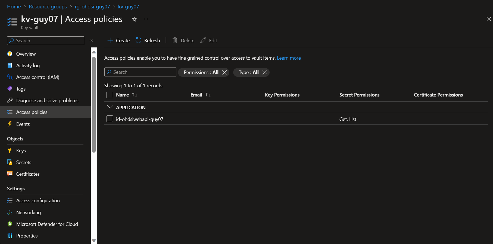
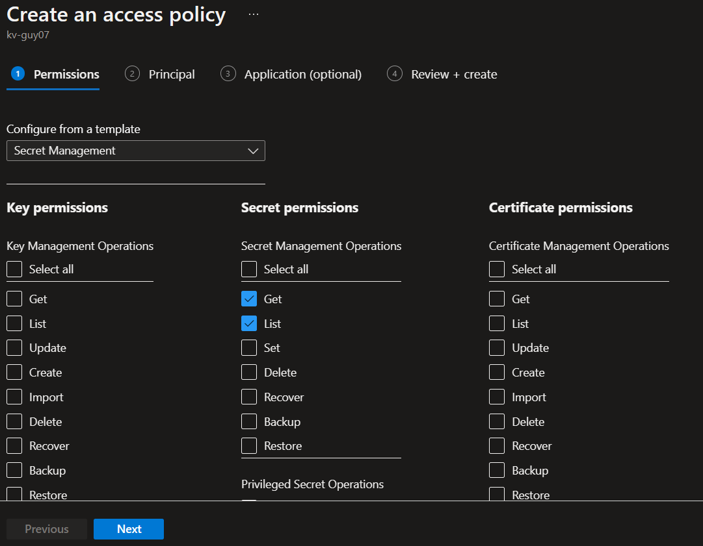
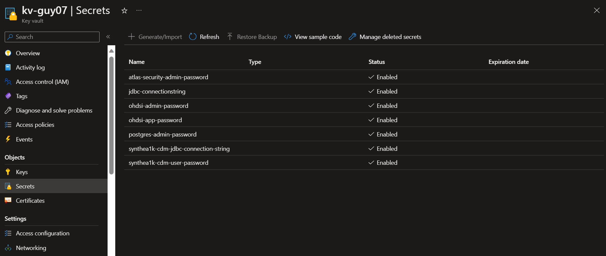
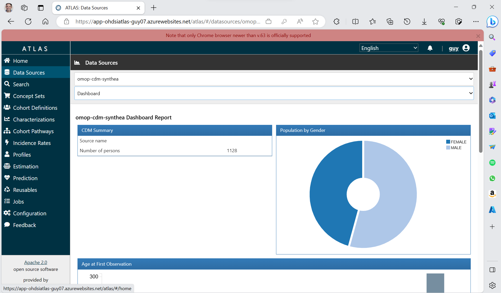

# Deployment Guide

## Prerequisites

In order to deploy OHDSI on Azure, you will need the following prerequisites:

1. Azure Subscription
2. Logged in with a user that has Contributor role on the subscription

## Setup

* To get started, click on deploy to Azure button. \
[](https://portal.azure.com/#create/Microsoft.Template/uri/https%3A%2F%2Fraw.githubusercontent.com%2Fmicrosoft%2FOHDSIonAzure%2Fmain%2Finfra%2Farm_output%2Fmain.json)

* Once you click, you will be redirected to custom deployment page, which will ask you to provide the following details:

| Name                          | Details                                                                                                       | Default Value                                                 |
|-------------------------------|---------------------------------------------------------------------------------------------------------------|---------------------------------------------------------------|
| Subscription                  | The name of the subscription.                                                                                 | N/A                                                           |
| Resource Group                | The name of the resource group.                                                                               | N/A                                                           |
| Region                        | The region of the resource group.                                                                             | As the resource group                                         |
| Location                      | The location of the resources.                                                                                | Resource group location                                       |
| Suffix                        | The suffix for the resource names.                                                                            | Unique string is being generated                              |
| CDM Container URL             | The URL prefix or Blob container where CDM files can be downloaded from.                                      | <https://omoppublic.blob.core.windows.net/shared/synthea1k/> |
| CDM SAS Token                 | The SAS token for accessing the CDM container. Leave empty if the files are available anonymously.            | Blank                                                         |
| OMOP CDM Database Type        | The type of database to host the CDM on. Valid values are: `PostgreSQL`, `Synapse Dedicated Pool`             | PostgreSQL                                                    |
| OMOP CDM Database Name        | The name of the OMOP CDM database.                                                                            | synthea1k                                                     |
| OMOP CDM Password             | The admin password for the OMOP CDM database.                                                                 | Unique password is being generated                            |
| App Plan SKU                  | The SKU for the app plan.                                                                                     | S1                                                            |
| Postgres SKU                  | The SKU for the PostgreSQL database.                                                                          | Standard_D2s_v3                                               |
| Postgres Storage Size         | The storage size for the PostgreSQL database.                                                                 | 32                                                            |
| Postgres Admin Password       | The password for the PostgreSQL admin user.                                                                   | Unique password is being generated                            |
| Postgres WebAPI Admin Password| The password for the PostgreSQL WebAPI admin user.                                                            | Unique password is being generated                            |
| Postgres WebAPI App Password  | The password for the PostgreSQL WebAPI app user.                                                              | Unique password is being generated                            |
| Atlas Security Admin Password | The password for the Atlas security admin user.                                                               | Unique password is being generated                            |
| Atlas Users List             | Atlas Users List              | The list of users for the Atlas system should be provided in the following format: username1,password1,username2,password2' and so on. Ensure usernames and passwords are in the correct order and do not include any additional spaces or characters between the credentials. Note that this format allows you to specify multiple sets of username-password pairs for different users. Make sure each pair is properly formatted and separated by commas. | None                                                          |None                                                          |
| Local Debug                   | Enable local debugging mode. If enabled, it will create a Firewall rule that will enable unrestricted access to the PostgreSQL database from any location.    | false                                                         |

* Once you fill all the details, click on Review + Create. The deployment will start and will take around 30 minutes to complete.

## Data platform

As noted above this solution currently supports storing the CDM on a managed PostgresSQL and on Azure Synapse Dedicated Pool. Please choose the right SKUs for each of the platforms depending on your dataset size.

### Synapse

This solution uses a sample CDM dataset that is hosted on GitHub releases. However, that isn't a valid source to load data into Synapse automatically.

The general idea is:
1. Create a new storage account and container separately and before you run the OHDSI deployment.
2. Download [synthea1k.tar](https://github.com/microsoft/OHDSIonAzure/releases/download/2.1/synthea1k.tar).
3. Extract the files in it to their gz form (don't gunzip them). 
```sh
tar xvf synthea1k.tar
``` 
4. Upload the gz files into the container created in step 1.
5. Create a SAS token, or configure for anonymous access.

From here you can continue with the deployment but remember to use the details from the new storage account in the deployment parameters.

Note that a default table distribution is used. If you intend to use a large dataset that might need to be adjusted per the comments [here](https://github.com/OHDSI/CommonDataModel/blob/main/inst/ddl/5.4/synapse/OMOPCDM_synapse_5.4_ddl.sql) (although this quickstart doesn't support this out-of-the-box you can make the right modifications yourself).

## Permissions

All the non-admin users you define in the deployment will automatically get permission to the data source created. 
If you add more users and/or new data sources then you should use Atlas to grant additional permissions.

## How to access Atlas

To access your Atlas website browse to `https://app-ohdsiatlas-myenv.azurewebsites.net/atlas` (replace `myenv` with your chosen suffix).

All passwords and connection strings are stored inside your Azure Key vault,
to access it sign into Azure portal and look for your Azure Key vault (i.e. `kv-myenv`).
click on `Access Policies` on the side menu.



Create a new policy with GET & LIST permissions under secrets for your identity.



After that you'll be able to access your environment secrets.



Sign in with one of the researches which you've provided during deployment and see that you can access your OMOP data source.

