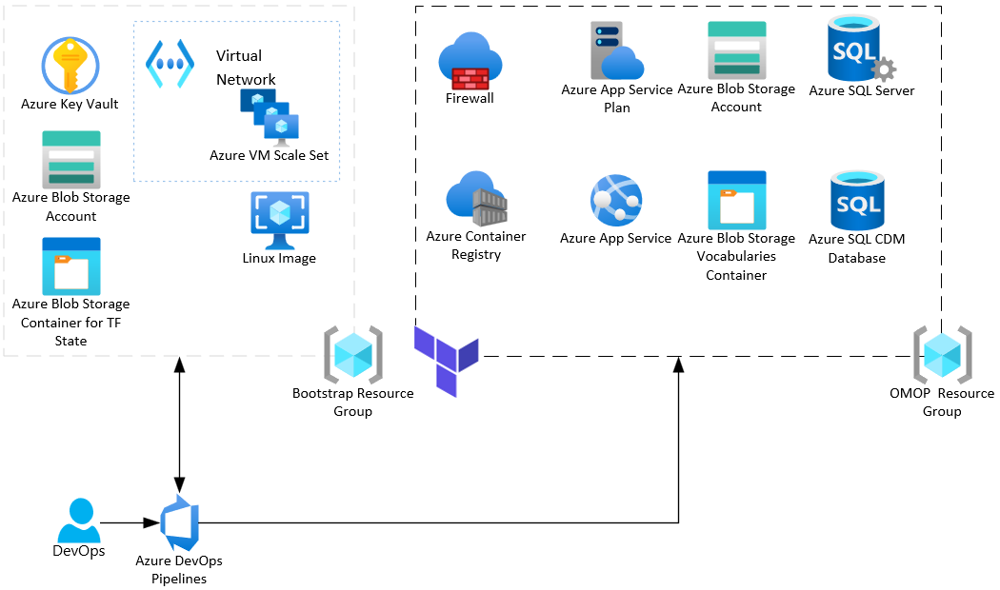

# OHDSI on Azure - Infrastructure Deployment

This guide will assist you in deploying the infrastructure required for an OHDSI CDM in Azure using Azure SQL Server. The OHDSI on Azure comes in two parts: (1) Infrastructure Deployment (2) [OHDSI Application Deployment](../apps/README.md).

Separation between infrastructure and application deployment allows for the benefit of removing dependencies between the two components. With OHDSI applications in constant development, it makes it challenging for Azure resources to pin to specific version everytime they are deployed or modified. Logical separation between infrastructure and application code could help reduce upkeeping of the terraform state file, difficulties with rolling back, and troubleshooting when an error occurs.

## Setup

### Prerequisites

This installation requires that you have access to the following:

1. Azure subscription
2. Terraform
3. Azure Storage Account to store TF state files

### Administrative Steps

You will need to work with your administrator to work through the steps noted in the [scripts](./scripts/) directory:

1. Work through the guidance in the [ado_bootstrap script](./scripts/ado_bootstrap.sh) to setup a Service Connection, Azure DevOps Builder, and TF State
    - Make sure to setup an [ado_builder image](./scripts/ado_builder.sh)
    - Be sure to capture the image based on the [ado_builder_capture notes](./scripts/ado_builder_capture.sh)
2. Set up Azure SQL with AAD, see the [notes](./scripts/sql_bootstrap.sh)

### Running Terraform

We leverage Terraform to automate the creation of resources to support the deployment of OHDSI CDM on Azure. Some of the major Terraform resources will inclulde:

- Azure SQL Server
- Azure SQL Database
- Storage Account
- App Service



Before running terraform, you will need to provide the required variables:

- environment name (i.e `dev`)
- resource location (i.e. `westus3`)

These variables can be used in the `variables.tf` file itself or provided upon running terraform commands. Execute the following commands when in the `infra/terraform` directory:

```
terraform init
terraform plan
terraform apply
```

### Security

Azure resources in this setup rely heavily on Managed Identities (MI) to authenticate with other services. This is powerful in the sense that it eliminates the need to manage passwords and other secrets. Examples of how MI is leveraged:

- Writing and reading from Azure SQL database
- Pulling Docker image from ACR
- Reading from Storage

#### Security Notes

Here's an overview for how MI (Managed Identity) vs. SP (Service Principal) are used with by the Azure resources.


Depending on the workflow, the Azure DevOps pipeline can either use the [Microft Hosted Agent](https://docs.microsoft.com/en-us/azure/devops/pipelines/agents/hosted?view=azure-devops&tabs=yaml) or an [Azure VMSS Agent](https://docs.microsoft.com/en-us/azure/devops/pipelines/agents/scale-set-agents?view=azure-devops).

1. The Azure DevOps Pipeline will use the SP Service Connection to connect to Azure SQL to setup the CDM (e.g. release using [sqlpackage](https://docs.microsoft.com/en-us/sql/tools/sqlpackage/sqlpackage?view=sql-server-ver15) for [dacpacs](https://docs.microsoft.com/en-us/sql/ssdt/extract-publish-and-register-dacpac-files?view=sql-server-ver15) or with [sqlcmd](https://docs.microsoft.com/en-us/sql/tools/sqlcmd-utility?view=sql-server-ver15) for scripts)
2. The Azure DevOps Pipeline will anonymously check the Azure App Service to see if it has started
3. The Azure DevOps Pipeline will use the SP Service Connection which has ACR pull rights to pull an image from ACR
4. The Azure DevOps pipeline will use the custom Azure VMSS agent pool and use the SP Service connection to pull the Broadsea Methods image from ACR.
5. The Azure DevOps Pipeline can also use custom agent pool pointing to an Azure VMSS.  In this case, the Azure VMSS MI will connect to Azure SQL to run Achilles using the Broadsea Methods container.
6. The Azure SQL Managed Identity can connect to Azure Storage to load the vocabulary into the CDM.
7. The Azure App Service MI can connect to Azure Container Registry to pull down the Broadsea Webtools container.
8. The Azure App Service MI will be used by the Broadsea Webtools container to connect to Azure SQL

#### Networking Notes

By design, this architecture has open networking.


The Azure VMSS used by the Azure DevOps Pipeline has a VNET, but it does not have any network restrictions.

Further, the Azure resources (ACR, Azure Storage, Azure SQL, and Azure App Services) allow public network access, which reflects the dev / test setup.  This networking setup is not advisable for a production scenario, which should have restricted network access based on your networking requirements.

## Next Step

- Uploading CDM vocabulary to Storage Account & importing it to the CDM database

1. Download the vocabulary from Athena (it's recommended to run this in an Azure VM in the same region as the Azure Storage)
   - Note that you should include vocabulary which will be compliant with your [CDM](../sql/CDM/v5.3.1/OMOP_Vocabulary_Indexes_Constraints/).
2. Upload the vocabulary into your vocabulary storage container
3. Assuming Post TF script has been run (via pipeline)
4. Vocabulary Release pipeline