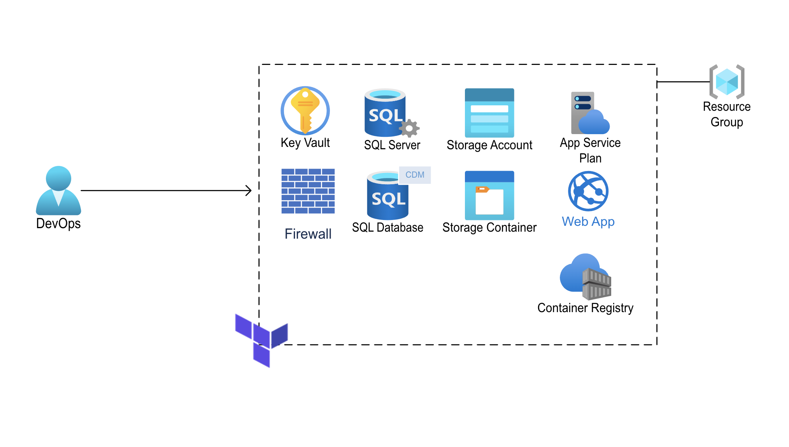

# OHDSI on Azure - Infrastructure Deployment

This guide will assist you in deploying the infrastructure required for an OHDSI CDM in Azure using Azure SQL Server. The OHDSI on Azure comes in two parts: (1) Infrastructure Deployment (2) [OHDSI Application Deployment](../apps/README.md).

Separation between infrastructure and application deployment allows for the benefit of removing dependencies between the two components. With OHDSI applications in constant development, it makes it challenging for Azure resources to pin to specific version everytime they are deployed or modified. Logical separation between infrastructure and application code could help reduce upkeeping of the terraform state file, difficulties with rolling back, and troubleshooting when an error occurs.

## Setup

### Prerequisites

This installation requires that you have access to the following:

1. Azure subscription
2. Terraform
3. Azure Storage Account to store TF state files

### Running Terraform

We leverage Terraform to automate the creation of resources to support the deployment of OHDSI CDM on Azure. Some of the major Terraform resources will inclulde:

- Azure SQL Server
- Azure SQL Database
- Storage Account
- Key Vault
- App Service



Before running terraform, you will need to provide the required variables:

- environment name (i.e `dev`)
- resource location (i.e. `westus2`)
- SQL Database admin password (will be stored in Key Vault)

These variables can be used in the `variables.tf` file itself or provided upon running terraform commands. Execute the following commands when in the `infra/` directory:

```
terraform init
terraform plan
terraform apply
```

### Security

Azure resources in this setup rely heavily on Managed Identities (MI) to authenticate with other services. This is powerful in the sense that it eliminates the need to manage passwords and other secrets. Examples of how MI is leveraged:

- Writing and reading from Azure SQL database
- Pulling Docker image from ACR
- Reading from Storage*

## Next Step

- Uploading CDM vocabulary to Storage Account & importing it the CDM database
