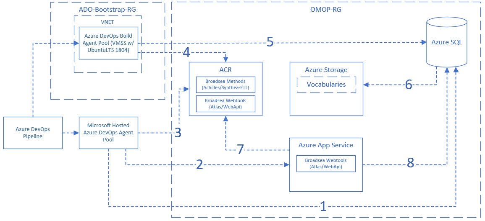
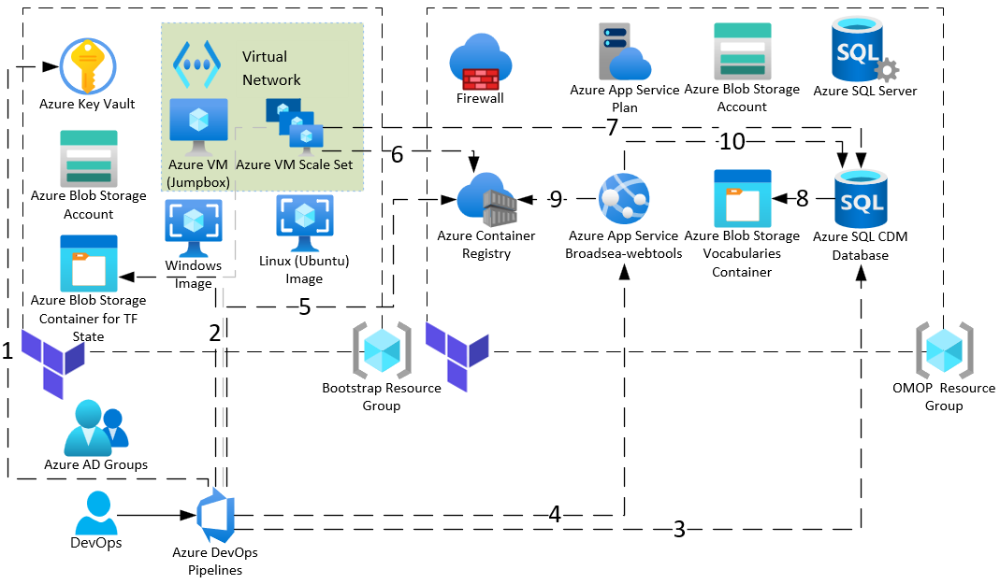

# OHDSI on Azure - Infrastructure Deployment

This guide will assist you in deploying the infrastructure required for an OHDSI CDM in Azure using Azure SQL Server. The OHDSI on Azure comes in two parts: (1) Infrastructure Deployment (2) [OHDSI Application Deployment](/apps/README.md).

Separation between infrastructure and application deployment allows for the benefit of removing dependencies between the two components. With OHDSI applications in constant development, it makes it challenging for Azure resources to pin to a specific version everytime they are deployed or modified. Logical separation between infrastructure and application code could help reduce upkeeping of the terraform state file, difficulties with rolling back, and troubleshooting when an error occurs.

## Setup

### Prerequisites

This installation requires that you have access to the following:

1. Azure subscription including:
    * [Azure DevOps](https://docs.microsoft.com/en-us/azure/devops/user-guide/project-admin-tutorial?toc=%2Fazure%2Fdevops%2Forganizations%2Ftoc.json&bc=%2Fazure%2Fdevops%2Forganizations%2Fbreadcrumb%2Ftoc.json&view=azure-devops)
    * Azure AD including [group management](https://docs.microsoft.com/en-us/azure/active-directory/roles/groups-concept)
2. [Terraform](https://learn.hashicorp.com/tutorials/terraform/install-cli?in=terraform/azure-get-started)
3. Azure Storage Account to [store TF state files](https://docs.microsoft.com/en-us/azure/developer/terraform/store-state-in-azure-storage)

### Administrative Steps

You can work with your administrator to setup your Azure environment.

Prior to working with the [Environment Terraform](/infra/README.md/#running-terraform), you will need to set up Azure DevOps.

#### Bootstrap Deployment Overview


You can work with your administrator to setup your [bootstrap resource group](/infra/terraform/bootstrap/README.md#setup-azure-bootstrap-resource-group), your [Azure AD Groups](/infra/terraform/bootstrap/README.md#setup-azure-ad-group), and your [Azure Devops](/infra/terraform/bootstrap/README.md#setup-azure-devops) which are depicted on the left side.

  > <mark>For convenience, your administrator can use the [bootstrap terraform project](/infra/terraform/bootstrap/README.md) to setup Azure DevOps along with your bootstrap resource group.</mark>

Working with your administrator in Azure DevOps, you can:

* Import this repository into an [Azure DevOps Repository](https://docs.microsoft.com/en-us/azure/devops/repos/git/import-git-repository?&view=azure-devops)
* Setup [your pipelines](https://docs.microsoft.com/en-us/azure/devops/pipelines/get-started/clone-import-pipeline?view=azure-devops&tabs=yaml#export-and-import-a-pipeline)
  * Your Azure DevOps pipelines can use [Variable Groups](/docs/update_your_variables.md) including a [Variable Group Linked to Azure Key Vault](https://docs.microsoft.com/en-us/azure/devops/pipelines/library/variable-groups?view=azure-devops&tabs=yaml#link-secrets-from-an-azure-key-vault) to manage secrets.
* Set up [Azure DevOps Environments](https://docs.microsoft.com/en-us/azure/devops/pipelines/process/environments?view=azure-devops)
* Set up your [Service Connection](https://docs.microsoft.com/en-us/azure/devops/pipelines/library/service-endpoints?view=azure-devops&tabs=yaml).
* Setup [Azure DevOps VMSS Agent Pools](https://docs.microsoft.com/en-us/azure/devops/pipelines/agents/scale-set-agents?view=azure-devops#update-an-existing-scale-set-with-a-new-custom-image) with links to:
  * Your Azure VMSS setup using [cloud-init](https://docs.microsoft.com/en-us/azure/virtual-machines/linux/using-cloud-init) including a [configuration](/infra/terraform/bootstrap/adobuilder.conf) for Linux
  * Your Azure Windows VMSS setup using a [custom script extension](https://docs.microsoft.com/en-us/azure/virtual-machines/extensions/custom-script-windows) with a [PowerShell script](/infra/terraform/bootstrap/scripts/build-agent-dependencies.ps1)

  > An alternative to hosting your Azure DevOps Agent Pools with [Azure VMSS](https://docs.microsoft.com/en-us/azure/devops/pipelines/agents/scale-set-agents?view=azure-devops) is to use [Docker](https://docs.microsoft.com/en-us/azure/devops/pipelines/agents/docker) with orchestration such as [Azure Container Instances](https://docs.microsoft.com/en-us/azure/devops/pipelines/agents/docker?view=azure-devops#start-the-image) or [Azure Kubernetes Service](https://docs.microsoft.com/en-us/azure/devops/pipelines/agents/docker?view=azure-devops#use-azure-kubernetes-service-cluster).
  Given that the current architecture includes [building](/pipelines/README.md#broadsea-build-pipeline) and [running](/pipelines/README.md#broadsea-release-pipeline) Docker containers as part your Azure DevOps pipelines, you should understand the security implications when using [docker within a docker container](https://docs.microsoft.com/en-us/azure/devops/pipelines/agents/docker?view=azure-devops#use-docker-within-a-docker-container).
  Further note that [Docker was replaced with containerd in Kubernetes 1.19](https://docs.microsoft.com/en-us/azure/aks/cluster-configuration#container-runtime-configuration).
* Setup a jumpbox using an Azure VM with ([Windows](https://docs.microsoft.com/en-us/azure/virtual-machines/windows/overview) or wotj [Linux](https://docs.microsoft.com/en-us/azure/virtual-machines/linux/overview)) to debug your Azure VMSS instances.

#### Administrative Steps Detailed

You will need to work with your administrator through the following steps:

1. Your administrator can run the [bootstrap Terraform project](/infra/terraform/bootstrap/README.md#bootstrap-terraform) locally to setup Azure DevOps and the bootstrap resource group, which should include the following:
    * An Azure DevOps [Service Connection](https://docs.microsoft.com/en-us/azure/devops/pipelines/library/service-endpoints?view=azure-devops&tabs=yaml)

    * An [Azure Virtual Machine Scale Set](https://docs.microsoft.com/en-us/azure/virtual-machine-scale-sets/overview) for Linux and an Azure Virtual Machine Scale Set for Windows which you can manually link to separate [Azure DevOps VMSS Agent Pools](https://docs.microsoft.com/en-us/azure/devops/pipelines/agents/scale-set-agents?view=azure-devops)

    * [Azure DevOps Variable Groups](https://docs.microsoft.com/en-us/azure/devops/pipelines/library/variable-groups?view=azure-devops&tabs=yaml) including:
        * Two (2) variable groups for environment setup:
            1. A variable group ending with `bootstrap-vg` which is linked to [Azure Key Vault secrets](https://docs.microsoft.com/en-us/azure/devops/pipelines/library/variable-groups?view=azure-devops&tabs=yaml#link-secrets-from-an-azure-key-vault) to run with your Environment Pipeline
            2. A variable group ending with `bootstrap-settings-vg` which is **not** linked to Azure Key Vault to configure running your Environment pipeline
        * One (1) variable group ending with `omop-environment-settings-vg` for application pipelines per environment

    * An Azure Storage Account to [store your TF State in Azure Storage](https://docs.microsoft.com/en-us/azure/developer/terraform/store-state-in-azure-storage?tabs=azure-cli) for your environment

    > You can review the [setup Azure Bootstrap Resource Group notes](/infra/terraform/bootstrap/README.md#setup-azure-bootstrap-resource-group), [setup Azure DevOps notes](/infra/terraform/bootstrap/README.md#setup-azure-devops), and [setup Azure AD Group notes](/infra/terraform/bootstrap/README.md#setup-azure-ad-group) for the full setup list included through the bootstrap Terraform project.

2. You will also need your administrator to run the [Environment Post Terraform Deployment Steps](/infra/terraform/omop/README.md/#step-3-run-post-terraform-deployment-steps) to complete your setup with your [environment Terraform](/infra/terraform/omop/README.md).

You can also review the [setup infra notes](/docs/setup/setup_infra.md) to ensure that you have completed the Azure DevOps configuration.

### Running Terraform

We leverage Terraform to automate the creation of resources to support the deployment of OHDSI CDM on Azure. Some of the major Terraform resources will include:

* [Azure SQL Server](https://docs.microsoft.com/en-us/azure/azure-sql/database/logical-servers)
* [Azure SQL Database](https://docs.microsoft.com/en-us/azure/azure-sql/database/sql-database-paas-overview)
* [Azure Blob Storage Account](https://docs.microsoft.com/en-us/azure/storage/common/storage-account-overview)
* [Azure App Service](https://docs.microsoft.com/en-us/azure/app-service/overview)
* [Azure Container Registry](https://docs.microsoft.com/en-us/azure/container-registry/container-registry-intro)


Before running terraform, you will need to provide the required variables:

* environment name (i.e `dev`)
* resource location (i.e. `westus3`)

These variables can be used in the `variables.tf` file itself or provided upon running terraform commands. Execute the following commands when in the `infra/terraform/omop` directory:

```bash
terraform init
terraform plan
terraform apply
```

Note, while you can run the terraform steps locally, you can also utilize the [TF environment pipeline](/pipelines/environments/TF-OMOP.yaml) to manage your environment too assuming that you have already pushed your [backend state to Azure Storage](https://docs.microsoft.com/en-us/azure/developer/terraform/store-state-in-azure-storage?tabs=azure-cli).

For more details, you can refer to the [Environment Terraform Readme](/infra/terraform/omop/README.md).

### Security

Azure resources in this setup rely heavily on Managed Identities (MI) to authenticate with other services. This is powerful in the sense that it eliminates the need to manage passwords and other secrets. Examples of how MI is leveraged:

* Writing and reading from Azure SQL database
* Pulling Docker image from ACR
* Reading from Storage

#### Security Notes

Here's an overview for how MI (Managed Identity) vs. SP (Service Principal) are used with the Azure resources.



Depending on the workflow, the Azure DevOps pipeline can either use the [Microsoft Hosted Agent](https://docs.microsoft.com/en-us/azure/devops/pipelines/agents/hosted?view=azure-devops&tabs=yaml) or an [Azure VMSS Agent](https://docs.microsoft.com/en-us/azure/devops/pipelines/agents/scale-set-agents?view=azure-devops).

1. The Azure DevOps Pipeline will use the SP Service Connection to get secrets from Key Vault for a [Key Vault linked Azure DevOps Variable Group](https://docs.microsoft.com/en-us/azure/devops/pipelines/library/variable-groups?view=azure-devops&tabs=yaml#link-secrets-from-an-azure-key-vault).  You can check the [TF Environment Pipeline](/pipelines/README.md/#environment-pipeline) for an example.
2. The Azure DevOps pipeline will use the SP Service Connection to retrieve the Terraform state file from Azure Storage.  You can check the [TF Environment Pipeline](/pipelines/README.md/#environment-pipeline) for an example.
3. The Azure DevOps Pipeline will use the SP Service Connection to connect to Azure SQL to setup the CDM (e.g. release using [sqlpackage](https://docs.microsoft.com/en-us/sql/tools/sqlpackage/sqlpackage?view=sql-server-ver15) for [dacpacs](https://docs.microsoft.com/en-us/sql/ssdt/extract-publish-and-register-dacpac-files?view=sql-server-ver15) or with [sqlcmd](https://docs.microsoft.com/en-us/sql/tools/sqlcmd-utility?view=sql-server-ver15) for scripts).
You can check the [Vocabulary Release Pipeline](/pipelines/README.md/#vocabulary-release-pipeline) for an example.
4. The Azure DevOps Pipeline will anonymously check the Azure App Service to see if it has started.  You can check the [Broadsea Release Pipeline](/pipelines/README.md#broadsea-release-pipeline) for an example.
5. The Azure DevOps Pipeline will use the SP Service Connection which has ACR pull rights to pull an image from Azure Container Registry.  You can check the [Broadsea Release Pipeline](/pipelines/README.md#broadsea-release-pipeline) for an example.
6. The Azure DevOps Pipeline will use the custom Azure VMSS agent pool and use the SP Service connection to pull the Broadsea Methods image from Azure Container Registry.  You can check the [Broadsea Release Pipeline](/pipelines/README.md#broadsea-release-pipeline) for an example.
7. The Azure DevOps Pipeline can also use a custom agent pool pointing to an Azure VMSS.  For example in the [Broadsea Release Pipeline](/pipelines/README.md#broadsea-release-pipeline) the Azure VMSS MI will connect to Azure SQL to run Achilles using the Broadsea Methods container.
8. The Azure SQL Managed Identity can connect to Azure Storage to load the vocabulary into the CDM as part of the [Vocabulary Release Pipeline](/pipelines/README.md/#vocabulary-release-pipeline).
9. The Azure App Service MI can connect to Azure Container Registry to pull down the Broadsea Webtools container.  This is setup through the [Broadsea Release Pipeline](/pipelines/README.md/#broadsea-release-pipeline).
10. The Azure App Service MI will be used by the Broadsea Webtools container to connect to Azure SQL.  This is setup through the [Broadsea Release Pipeline](/pipelines/README.md/#broadsea-release-pipeline).

#### Networking Notes

By design, this architecture has open networking.



The Azure VMSS used by the Azure DevOps Pipeline has an [Azure Virtual Network](https://docs.microsoft.com/en-us/azure/virtual-network/virtual-networks-overview), but it does not have any network restrictions.

Further, the Azure resources (Azure Container Registry, Azure Key Vault, Azure Storage, Azure SQL, and Azure App Services) allow public network access, which reflects the dev / test setup.  This networking setup is **not advisable** for a production scenario, which should have restricted network access based on your networking requirements.

## Next Step

* You will want to make sure you can [setup the vocabulary](/docs/setup/setup_vocabulary.md) for your environment.
